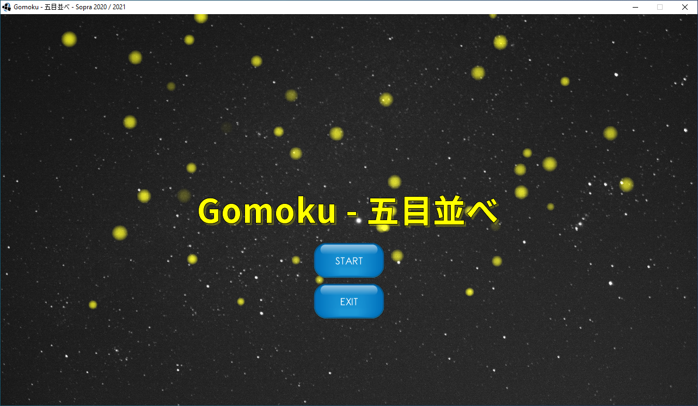
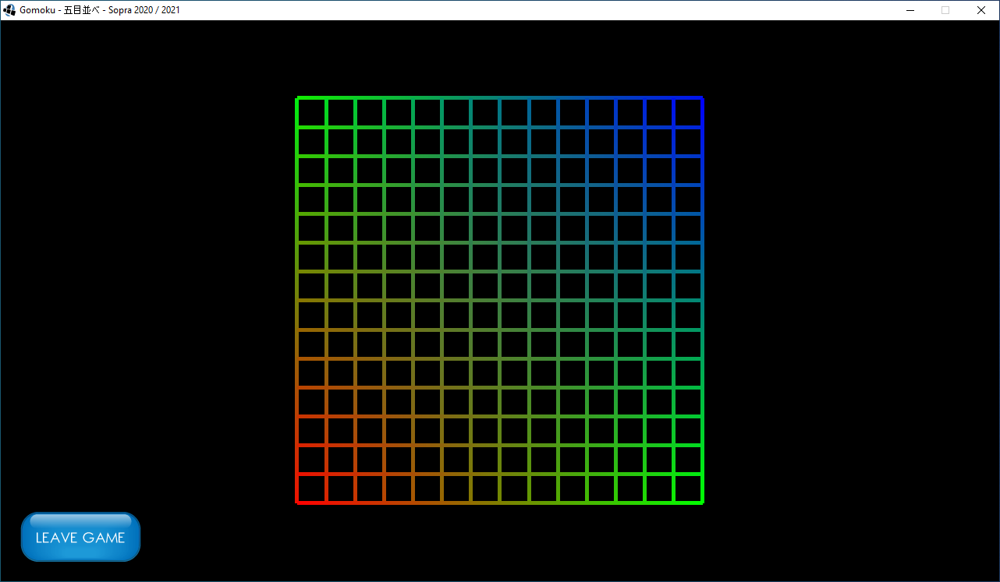

# Gomoku - 五目並べ
LibGDX implementation of the Gomoku board game.

## Lastenheft

For the requirement specifications have a look at the specifications folder.

## Tools

Have a look at the tools folder for usefull LibGDX tools like the 'Particle Editor'.

## Commit conventions

This repository makes use of conventional commits:

https://www.conventionalcommits.org/en/v1.0.0/

## Usefull GitHub repositories

LibGDX UI Skins: https://github.com/czyzby/gdx-skins

WebSockets: https://github.com/TooTallNate/Java-WebSocket

JSON: https://github.com/google/gson

## Tested System Configurations

Windows 10 x64 with Java JDK 15

Windows 10 x64 with Java JDK 11

Windows 10 x64 with Java JDK 8

## Download Java JDK

Download: [Java JDK 15 non-LTS](https://www.oracle.com/java/technologies/javase-jdk15-downloads.html)

Download: [Java JDK 11 LTS](https://www.oracle.com/java/technologies/javase-jdk11-downloads.html)

Download: [Java JDK 8 LTS](https://www.oracle.com/de/java/technologies/javase/javase-jdk8-downloads.html)

Recommendation: Java JDK 11 LTS

See: [Java version history - Wikipedia](https://en.wikipedia.org/wiki/Java_version_history) - [Java SE Support Roadmap](https://www.oracle.com/java/technologies/java-se-support-roadmap.html)

## IntelliJ

If you want to use IntelliJ you can use the Community Edition, but it is also possible to get the Ultimate Edition for free as a student.

If you are using IntelliJ and want to run the DesktopLauncher and the GomokuServer with one click on the 'Run' button, then you can create a compound launcher. Have a look at the **IntelliJ_Compound.md** file located in the **help** folder.