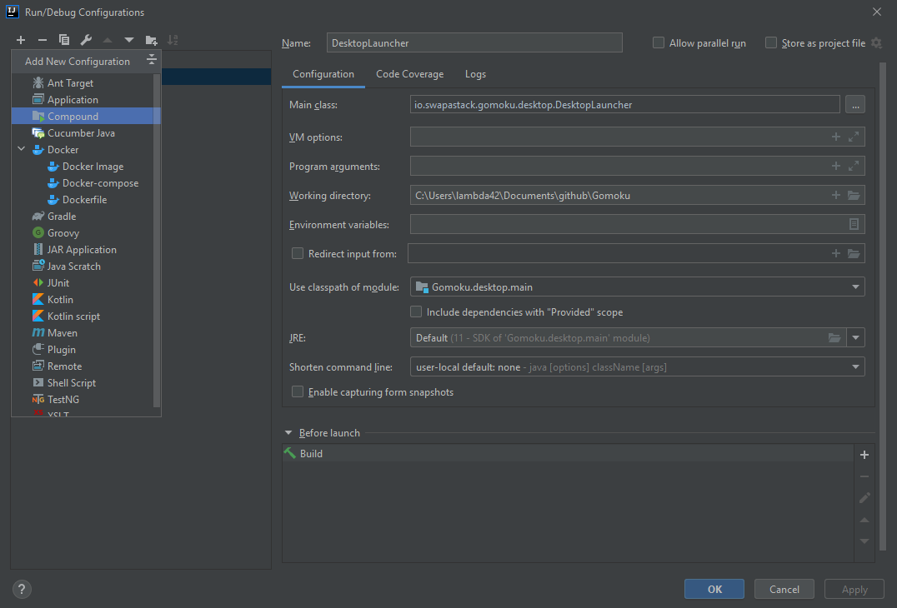

# IntelliJ Compound Launcher

A short tutorial on how to create a compound launcher.

Click on the 'down arrow' next to the 'DesktopLauncher' label.

Click on 'Edit Configurations...'.

Click on the '+' symbol in the top left corner.

Click on 'Compound'.

Rename the Compound from 'Unnamed' to 'Gomoku'.

Click on 'Apply'.

Click on 'Ok'.

Now the Compound Luncher is ready.

Click on the green 'Run' icon to run the 'DesktopLauncher' and 'GomokuServer'.

