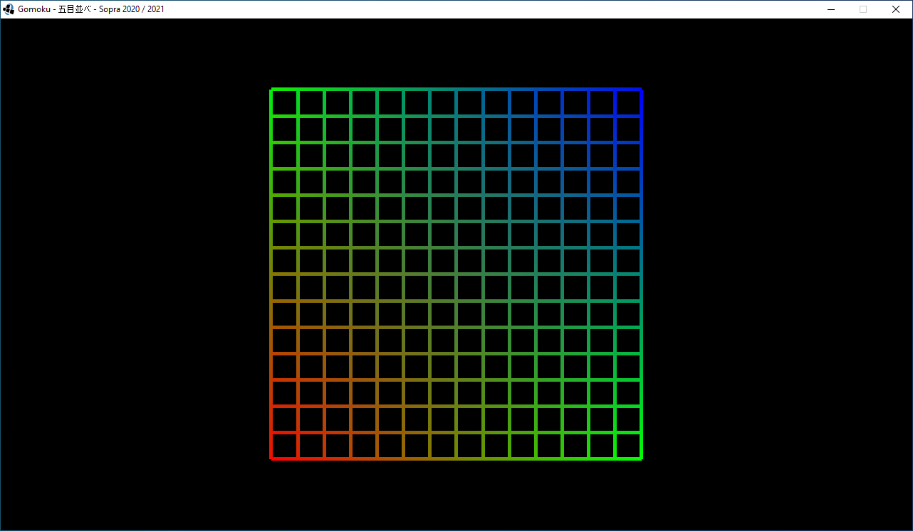

# Lastenheft Gomoku - 五目並べ

Version 0.5 vom 17.12.2020

[TOC]

## Abstract

Dieses Lastenheft beschreibt die Anforderungen an das rundenbasierte 'Hot Seat' Spiel Gomoku, welches über einen Zeitraum von einem Semester entwickelt werden soll. Bei einem 'Hot Seat' Spiel können mehrere Spieler ein Spiel an nur einem Computer spielen.

## Produkt und Einsatzszenarien

Im Wintersemester 2020 / 2021 soll das Mehrspielerspiel Gomoku entwickelt werden. In diesem Kapitel wird die Architektur des Systems beschrieben. Desweiteren werden die Komponenten des Systems beschrieben und technische Vorgaben gemacht.

### Komponenten und Architektur

Bei Gomoku handelt es sich um ein lokales Multiplayerspiel nach dem 'Hot Seat' Spielprinzip. Zur Übermittlung des Gewinners an einen online Server wird eine Client-Server-Architektur verwendet.

#### Server

**Hinweis:** dieser Abschnitt wurde am 17.12.2020 angepasst.

Der Server wird von Ihnen implementiert. Der Server hat die Aufgabe die Spielhistorie zu persistieren. Hierfür kommuniziert der Server mit dem Client über das im Netzwerkstandard vorgegebene Protokoll. 

#### Client

Der Client wird vom Spieler bedient und übermittelt das Ergebnis einer abgeschlossenen Spielpartie an den Server.

### Anwendungssprache, Implementierungssprache und Dokumentationssprache

Die Anwendungssprache ist deutsch oder englisch.

Die Impementierungssprache ist englisch.

Die Dokumentationssprache ist deutsch oder englisch.

### Programmiersprachen und Technologien

Die empfohlene Programmiersprache zur Implementierung von Gomoku ist Java.

Das empfohlene Framework zur Realisierung der graphischen Oberfläche ist LibGDX.

Falls Sie eine andere Programmiersprache oder ein anderes Framework verwenden möchten, dann besprechen Sie dies mit Ihrem Tutor / Ihrer Tutorin. Die Verwendung einer anderen Programmiersprache oder eines anderen Frameworks ist nur nach ausdrücklicher Erlaubnis Ihrer Tutorin / Ihres Tutors zulässig, da Ihre finale Abgabe von der entsprechenden Person korrigiert werden wird.

Die Verwendung einer Game Engine (wie zum Beispiel: Unity, Unreal, CryEngine, Godot) ist zur Umsetzung von Gomoku **nicht** gestattet.

### Plattformen

Ihre Anwendung sollte mindestens auf einer der nachfolgenden Plattformen lauffähig sein: Windows 10, Linux.

Besprechen Sie mit Ihrem Tutor / Ihrer Tutorin eventuell weitere Plattformeinschränkungen oder zusätzlich erlaubte Plattformen wie zum Beispiel OSX.

Auch hier gilt, Ihr Tutor / Ihre Tutorin muss in der Lage sein Ihre finale Abgabe auszuführen.

### Netwerkkommunikation und Nachrichtenprotokoll

Um das Spielergebnis an den Server übetragen zu können, müssen Nachrichten zwischen dem Client und dem Server ausgetauscht werden.

Zum Austausch der Nachrichten müssen JSON kodierte String über eine WebSocket Verbindung gesendet werden.

Das Nachrichtenformat wird in einem Netzwerkstandarddokument  spezifiziert, welches Sie rechtzeitig erhalten werden.

## Spielregeln von Gomoku

Dieses Kapitel beschreibt die Regeln und den Spielablauf des Spiels Gomoku.

### Teilnehmeranzahl

Das Spiel Gomoku kann von (exakt) zwei Spielern gespielt werden.

### Spielfeld

Das Spielfeld entspricht einem 15x15 Go-Spielfeld, siehe nachfolgende Abbildung:

### Spielsteine

Traditionell wird Gomoku mit Go Steinen gespielt. Dabei handelt es sich um runde schwarze beziehungsweise weiße Spielsteine. Die Farbe und Form der Spielsteien ist für die Implementierung egal. Wichtig ist nur, dass diese voneinander unterscheidbar sind.

Spielsteine können auf die Kreuzung der Spielfeldlinien gelegt werden. Es können allerdings keine Spielsteine gestapelt werden.

Nachfolgend wird angenommen, dass es schwarze und weiße Spielsteine geben wird.

### Eröffnungsregel (Swap2)

Die Swap2 Eröffnungsregel definiert den ersten Spielzug. Falls der Spieler mit den schwarzen Spielsteinen beginnt, so legt dieser zwei schwarze und einen weißen Spielstein auf das Spielfeld.

Der zweite Spieler wählt dann eine von drei Optionen:

1. er spielt ab sofort die schwarzen Spielsteine
2. er spielt die weißen Spielsteine und legt einen weiteren weißen Spielstein
3. er spielt zwei weitere Spielsteine, einen weißen und einen schwarzen Spielstein und überlässt so dem ersten Spieler die Farbwahl

Die Swap2 Eröffnungsregel gleicht den Vorteil des das Spiel eröffnenden Spielers aus.

Siehe auch: [Gomoku Eröffnungsregeln](http://gomokuworld.com/gomoku/2)

### Spielzüge

Nachdem die Eröffnungsregel vorüber ist, legen die Spieler abwechselnd jeweils einen weiteren Stein auf das Spielfeld bis eine Siegbedingung eintritt.

### Siegbedingungen

Der Spieler der zuerst fünf seiner Spielsteine zusammenhängend auf:

* einer Zeile
* einer Spalte
* einer Diagonalen

platzieren kann, gewinnt das Spiel.

## Vorgaben zum Entwicklungsprozess

Die Implementierung muss alleine erfolgen.

Das Projekt muss in einem Git Repository auf gitlab.informatik.uni-ulm.de versioniert werden.

Der Quellcode muss sinnvoll und ausführlich dokumentiert werden.

Es wird eine Abnahme des Projekts erfolgen, Ihr Tutor / Ihre Tutorin wird Ihnen eventuell gezielt Fragen zu Ihrem Quellcode stellen. Sie müssen in der Lage sein, diese Fragen zu beantworten.

**Eine erfolgreiche Abnahme des Einzelprojekts ist Voraussetzung zur Teilnahme am zweiten Teil des Softwaregrundprojekts (Sopra).**